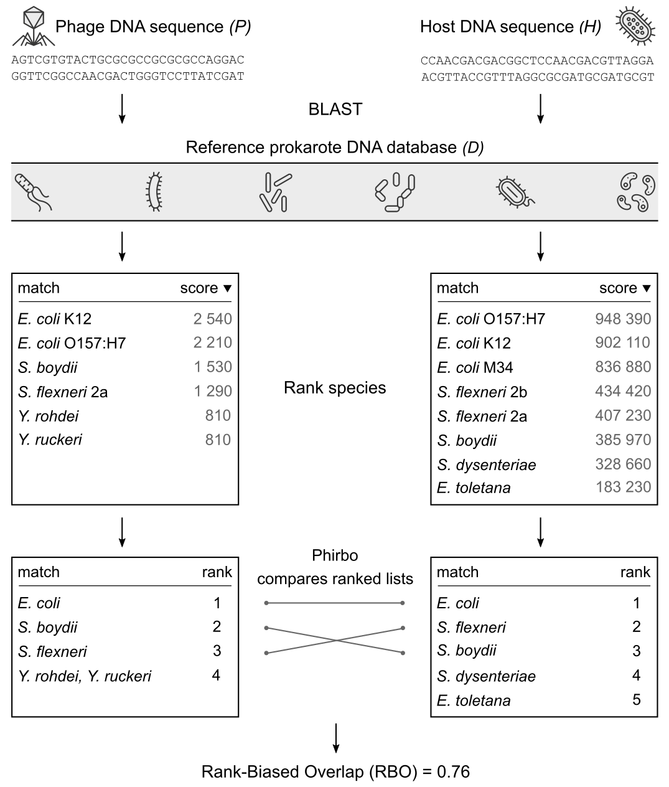

# Phirbo

A tool to predict prokaryotic hosts for phage (meta)genomic sequences. To predict phage-host interactions Phirbo uses information on sequence similarity between phages and bacteria as well as among bacteria.


## Requirements

You'll need Python 3.6 or greater to run `phirbo.py`.

#### Python dependencies:

* [numpy](http://www.numpy.org) >= 1.16.4
   > Use pip to install: `python3 -m pip install numpy`
* [pandas](https://pandas.pydata.org/) >= 0.22.1. 
   > Use pip to install: `python3 -m pip install pandas`


## Installation

Since Phirbo is just a single script, no installation is required. You can simply clone it and run it:

```bash
git clone https://github.com/aziele/phirbo.git
phirbo/phirbo.py --help
```

If you plan on using it often, you can copy it to someplace in your PATH variable for easier access:

```bash
cp phirbo/phirbo.py ~/.local/bin
phirbo.py --help
```


## Method
Phirbo links phage to host sequences through intermediate, common reference sequences that are potentially homologous to both phage and host sequences. 

In order to link phage (*P*) to host (*H*) sequence through intermediate sequences, phage and host sequences need to be used as queries in two separate sequence similarity searches (e.g., BLAST) against the same reference database of prokaryotic genomes (*D*). One BLAST search is performed for phage query (*P*) and the other for host query (*H*). The two lists of BLAST results, *P → D* and *H → D*, contain prokaryotic genomes ordered by decreasing score. To avoid a taxonomic bias due to multiple genomes of the same prokaryote species (e.g., *Escherichia coli*), prokaryotic species can be ranked according to their first appearance in the BLAST list. In this way, both ranked lists represent phage and host profiles consisting of the ranks of top-score prokaryotic species. 

Phirbo estimates the phage-host relationship by comparing the content and order between phage and host ranked lists using [Rank-Biased Overlap (RBO)](http://dx.doi.org/10.1145/1852102.1852106) measure. Briefly, RBO fosters comparison of ranked lists of different lengths with heavier weights for matching the higher-ranking items. RBO ranges between `0` and `1`, where `0` means that the lists are disjoint (have no items in common) and `1` means that the lists are identical in content and order.

<p align="center"></p>


## Input data
You need to provide ranked lists - separately in two directories - for phage and bacteria genomes. Every genome should have its own ranked list in a text file. The text format lists bateria species separated by a new line (if two or more species are the same in rank they should be comma-separated in one line) (see the example file format: [example/virus/NC_000866.txt](example/virus/NC_000866.txt)).


## Quick usage

To run Phirbo provide two input directories (for phages and bacteria) containing your ranked lists, and an output file name.

```bash
phirbo.py example/virus/ example/host/ example/predictions.csv
```

This will output two files:
* `predictions.csv` containing phage-host predictions (i.e., a top score host for each phage). See the example output: [example/predictions.csv](example/predictions.csv)
* `predictions.matrix.csv` containing a matrix of scores between every phage and every host (phages in columns, bacteria in rows). See the example output matrix: [example/predictions.matrix.csv](example/predictions.csv.matrix.csv)

## Full usage

```
usage: phirbo.py [-h] [--p P] [--k K] [--t NUM_THREADS]
                 virus_dir host_dir output_file

Phirbo (v1.0) predicts hosts from phage (meta)genomic data

positional arguments:
  virus_dir        Input directory w/ ranked lists for viruses
  host_dir         Input directory w/ ranked lists for hosts
  output_file      Output file name

optional arguments:
  -h, --help       show this help message and exit
  --p P            RBO parameter in range (0, 1) determines the degree of top-
                   weightedness of RBO measure. High p implies strong emphasis
                   on top ranked items [default = 0.75]
  --k K            Truncate all ranked lists to the first `k` rankings to
                   calculate RBO. To disable the truncation use --k 0 [default
                   = 30]
  --t NUM_THREADS  Number of threads (CPUs) [default = 32]
```

## Further analyses

The output files can be further analyzed with R, Python or Excel spreadsheet.

### Top *n* hosts for each phage

R:

```R
csv = read.csv("predictions.matrix.csv", row.names=1);
top_n_hosts = 3

for (col in colnames(csv)) {
    print(csv[order(csv[col], decreasing = T)[1:top_n_hosts],][col]);
}
```

Python:

```python
import pandas as pd

df = pd.read_csv("predictions.csv.matrix.csv", index_col=0)
top_n_hosts = 3

print(df.unstack()
        .groupby(level=0, group_keys=False)
        .nlargest(top_n_hosts)
        .reset_index()
        .to_string(header=None, index=False))
```

### Filter phage-host pairs by a score

For example, show phage-host pairs with score ≥ `0.8`.

Python:

```python
import pandas as pd

df = pd.read_csv("predictions.csv.matrix.csv", index_col=0)
min_score = 0.8

s = df.unstack()
print(s[s >= min_score]
     .reset_index()
     .sort_values(["level_0", 0], ascending=[True, False])
     .to_string(header=None, index=False))
```

### Distribution of scores for a given phage

Python:

```python
import pandas as pd

phage_id = "NC_000866"

df = pd.read_csv("predictions.csv.matrix.csv", index_col=0)
scores = df[phage_id]
hist = scores.hist()                    # Needs matplotlib.
hist.figure.savefig('figure.pdf')

print(f'Min    : {scores.min()}')
print(f'Q1     : {scores.quantile(0.25)}')
print(f'Median : {scores.median()}')
print(f'Q3     : {scores.quantile(0.75)}')
print(f'Max    : {scores.max()}')
```

### Distribution of scores for all phages

```Python
import pandas as pd

df = pd.read_csv("predictions.csv.matrix.csv", index_col=0)
scores = df.stack()
hist = scores.hist(grid=False)
hist.figure.savefig('figure.pdf')
```

## License

[GNU General Public License, version 3](https://www.gnu.org/licenses/gpl-3.0.html)